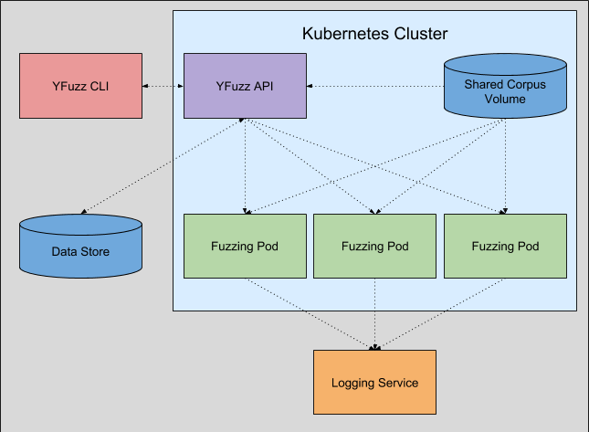

# yFuzz

 

yFuzz is a project for running fuzzing jobs at scale with Kubernetes.

**It is still in early development and not ready for general use.**

## Table of Contents

- [yFuzz](#yfuzz)
  - [Table of Contents](#table-of-contents)
  - [Background](#background)
  - [Projects](#projects)
  - [Architecture](#architecture)
    - [Planned:](#planned)
  - [Directory Structure](#directory-structure)
  - [Contribute](#contribute)
  - [License](#license)

## Background

Popular fuzzers such as [Libfuzzer](https://llvm.org/docs/LibFuzzer.html) and [AFL](http://lcamtuf.coredump.cx/afl/) have support for running multiple fuzzing processes at once. yFuzz aims to take advantage of this by running each process on a different Kubernetes pod to speed up the fuzzing process.

For open-source projects, this can be done with [OSS-Fuzz](https://github.com/google/oss-fuzz), with some restrictions:
* The targeted project must be open-source and widely used
* The targeted project must be accepted by the OSS-Fuzz team
* Details such as timeouts and available fuzzers are limited by OSS-Fuzz

yFuzz aims to be an on-premises solution for distributed fuzzing, so that projects that don't meet these constraints can still be fuzzed.

Additional features to make the fuzzing process easier are also planned, such as automatic generation/suggestion of fuzz targets. We welcome all feedback and suggestions as we consider other use-cases.

## Projects
* [yFuzz Server](services/yfuzz-server): The main API server for yFuzz.
* [yFuzz CLI](cmd/yfuzz-cli): A command-line interface for interacting with the yFuzz server.
* [yFuzz Scripts](images/scripts): Docker image with scripts used by yFuzz containers.

## Architecture

The yFuzz API resides in a kubernetes cluster along with the pods that run the fuzzing jobs and a shared volume that holds corpus data to be shared between the pods.

### Planned:
* Each fuzzing pod will have a logging sidecar which streams logs from the pod to a centralized logging service.
* The yFuzz API will have access to a data store with information about users, jobs, and crash files.

## Directory Structure
* `cmd`: Command line utilities.
* `docs`: Documentation relating to yFuzz.
* `images`: Dockerfiles used by yFuzz.
* `pkg`: Shared libraries and packages.
* `scripts`: Scripts for CI tooling.
* `services`: Long-running services, such as the yfuzz-server.

## Contribute

Please refer to [the contributing.md file](CONTRIBUTING.md) for information about how to get involved. We welcome issues, questions, and pull requests. Pull Requests are welcome

## License
This project is licensed under the terms of the [Apache 2.0](LICENSE) open source license.
